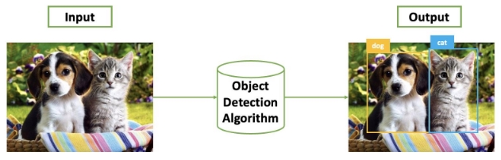
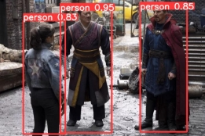

# YOLOv8-Object-Detection

## Part I: Introduction

Object Detection is a computer vision task that involves building a program capable of returning the coordinates (bounding box) and class names of objects present in an image that we want to detect.

**Figure 1:** Input/Output of Object Detection task with the desired objects being Dog and Cat.

 

**(a) Input Image** (b) YOLOv8 Detection Results

**Figure 2:** Illustrative example of the results of the Human Detection program using YOLOv8.

This project implements a Python program for Human Detection in an image using the YOLOv8 algorithm.

## Part II: Program Installation

To install and use the YOLOv8 algorithm, follow these instructions:

1. **Download YOLOv8 Source Code from GitHub**: To use YOLOv8, we need to download the source code from the YOLOv8 GitHub repository. The YOLOv8 source code is publicly available on GitHub. Follow these steps:
   - Step 1: Access the YOLOv8 GitHub repository [here](https://github.com/ultralytics/ultralytics). If successful, you will see the interface as shown below:

   

   **Figure 8:** YOLOv8 GitHub interface

   - Step 2: On the YOLOv8 GitHub page, click on the "Code" tab (highlighted in blue as shown below) and select the "Copy" button to copy the repository link:

   

   **Figure 9:** Copy the repository link to download YOLOv8 source code

   - Step 3: Go back to Google Colab and create a code cell using the command: `!git clone <link>` (replace `<link>` with the copied GitHub repository link from step 2). If the code cell executes successfully, you will see the following result:

   

   **Figure 10:** Clone YOLOv8 source code using git clone command

   To verify, you can refresh the Files section of Google Colab to check if the YOLOv8 folder has appeared.

   

   **Figure 11:** YOLOv8 folder

2. **Install Required Python Libraries**: The YOLOv8 source code is built using several Python libraries. To run YOLOv8, we need to install the required libraries. YOLOv8 provides built-in support for a library called "ultralytics," which can be installed using the pip command:

   

   **Figure 12:** Install the ultralytics library using pip command

   Alternatively, you can also install the required libraries using the setup file provided in the YOLOv8 source code:

   

   **Figure 13:** Install required libraries using the setup file
